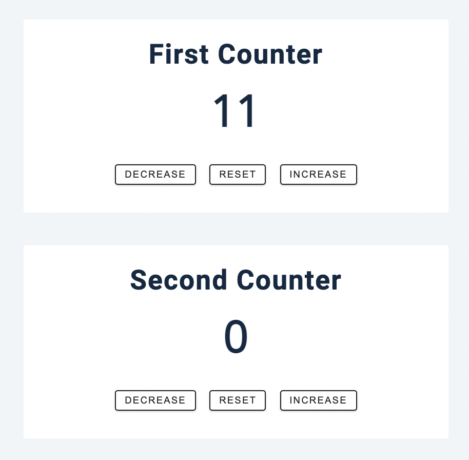
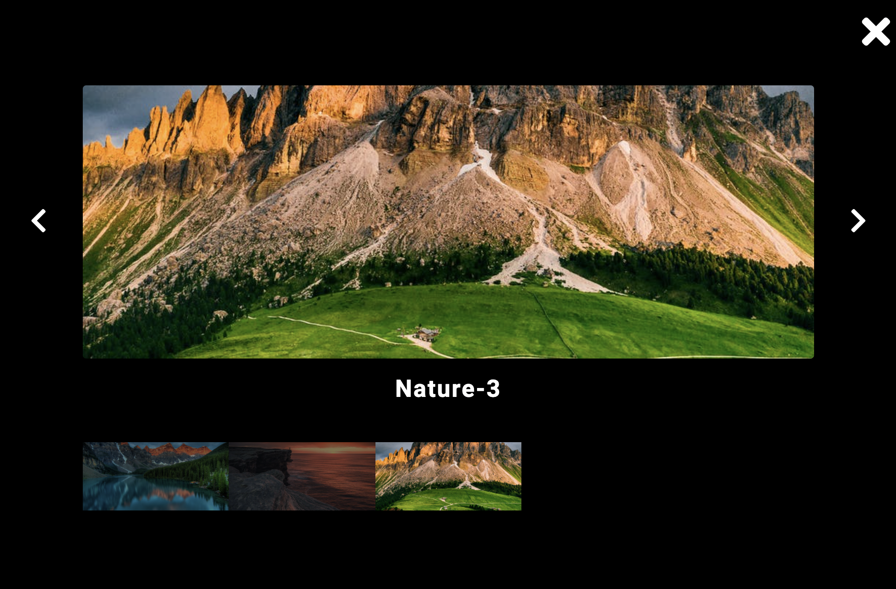
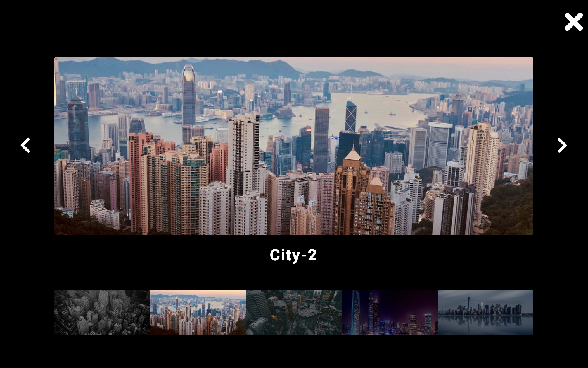

## JS OOP Projects. Using Object Oriented Programming principles.

#### Two Counters. Part of John Smilga's JS Tutorial

- using constructor function setup
- refactoring to a class

  

#### Gallery

- the main idea of the project is the same, using object oriented programming principals to set up multiple instances that rely on the same code
- we have two sets of pictures: nature and city. Ones we click on the nature ones it opens up the corresponding gallery. We can navigate through the gallery (forwards and backwards, click on individual pictures and sets it as a main image)

  

  

  

:heart:
